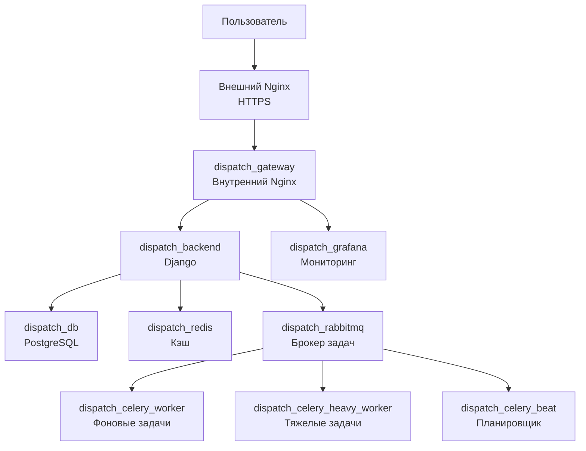
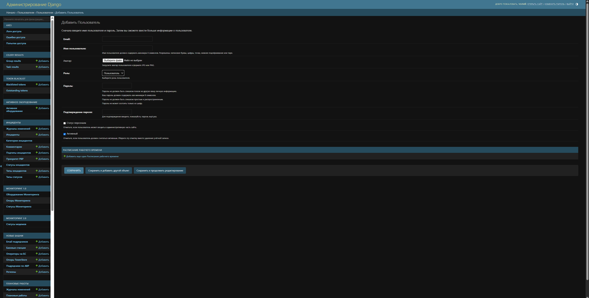
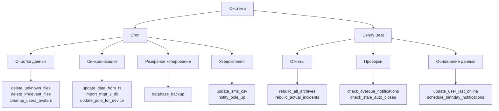

<h1 align="center">DISPATCH</h1>

**DISPATCH** — это полностью автономная платформа для управления инцидентами компании ООО «Новые Башни». Система автоматизирует процессы мониторинга, распределения задач и коммуникации с подрядчиками и заявителями, обеспечивая прозрачность и контроль сроков (SLA).
<div align="center">
  
  <br>
  <em>Рис. 1 — Web интерфейс системы</em>
</div>

---

## 📑 Оглавление
1. [Модель инцидента](#-модель-инцидента)
   - [Атрибуты инцидента](#атрибуты-инцидента)
   - [История и аудит](#история-и-аудит)
   - [Интеграция с электронной почтой](#интеграция-с-электронной-почтой)
   - [Инструменты коммуникации](#инструменты-коммуникации)
   - [Связи между инцидентами](#связи-между-инцидентами)
   - [Плановые работы](#плановые-работы)
2. [Как всё устроено под капотом](#-как-всё-устроено-под-капотом)
   - [Основные компоненты](#основные-компоненты)
   - [Управление процессами (Supervisor)](#управление-процессами-supervisor)
   - [Внутренний Nginx — обратный прокси и сервер статики](#внутренний-nginx--обратный-прокси-и-сервер-статики)
   - [Внешний Nginx — HTTPS](#внешний-nginx--https)
   - [Логирование и данные](#логирование-и-данные)
3. [Статистика и аналитика (Grafana)](#-статистика-и-аналитика-grafana)
   - [Сконфигурированные дашборды](#сконфигурированные-дашборды)
4. [Администрирование](#-администрирование)
   - [Роли пользователей](#роли-пользователей)
   - [Восстановление и безопасность](#восстановление-и-безопасность)
   - [Управление активным оборудованием](#управление-активным-оборудованием)
5. [Интеграции](#-интеграции)
    - [Синхронизация с корпоративной БД](#синхронизация-с-корпоративной-бд)
    - [Подключения к внешним БД (только чтение)](#подключения-к-внешним-бд-только-чтение)
    - [SMS-оповещения](#sms-оповещения)
    - [Run Sharing](#run-sharing)
6. [Фоновые задачи (Cron & Celery)](#-фоновые-задачи-cron--celery)
    - [Работа с файловой системой](#работа-с-файловой-системой)
    - [Очистка данных](#очистка-данных)
    - [Синхронизация и импорт](#синхронизация-и-импорт)
    - [Уведомления и отчеты](#уведомления-и-отчеты)
    - [Задачи Celery Beat](#задачи-celery-beat)
7. [Файл окружения `.env`](#-файл-окружения-env)
8. [Полезные команды](#-полезные-команды)
9. [Автор](#-автор)

---

## 🗂 Модель инцидента
Инцидент — ключевой объект системы, привязанный к конкретной опоре и базовой станции (БС).
<div align="center">
  
  <br>
  <em>Рис. 2 — Основная форма карточки инцидента</em>
</div>

### Атрибуты инцидента
- **Классификация**: Тип и подтип инцидента.
- **Приоритет РВР**: Уровень срочности работ.
- **Категории работ**: Инцидент может включать несколько типов работ одновременно:
  - **АВР** (Аварийно-восстановительные работы) — SLA зависит от типа аварии.
  - **РВР** (Ремонтно-восстановительные работы) — SLA зависит от приоритета РВР.
  - **ДГУ** (Дизелирование) — фиксированный SLA 15 дней (превышение срока ведет к резкому росту затрат на топливо).
  - **ЭКС** (Эксплуатационные работы) — фиксированный SLA 15 дней.
- **Сроки**: Для каждой категории работ указываются даты начала и окончания.

### История и аудит
Система ведет полную историю изменений статусов и журнал модификации атрибутов (тип, подтип, привязка к опоре и т.д.).

### Интеграция с электронной почтой
Система автоматически обрабатывает входящие и исходящие письма компании, распределяя их по инцидентам.

**Алгоритм привязки писем к инцидентам**:
1. **По коду инцидента**: Поиск уникального кода в теме письма (приоритетный метод).
2. **По цепочке переписки**: Анализ заголовков Message-ID, Message-Reply-To, Message-Reference.
3. **По контенту**: Совпадение тела письма, отправителя и темы.

*Примечание: В редких случаях, если алгоритм находит несколько кандидатов, выбирается наиболее актуальный инцидент в цепочке.*

**Автоматизация процессов**:
- **Создание новых инцидентов**: Если входящее письмо не привязано к существующему инциденту, система автоматически создает новый. Ответственный диспетчер назначается автоматически с учетом его текущего графика работы и загрузки (балансировка нагрузки).
- **Распознавание объектов**: Если опора/БС не указана, система ищет шифр и номер БС в теме или теле письма.
- **Уведомления**:
  - Каждое новое входящее письмо ставит флаг «НЕ ПРОЧИТАНО» инциденту.
  - Формируются push-уведомления для ответственного лица и дежурных диспетчеров (в том числе вне графика, если требуется срочное вмешательство).
- **Обработка закрытых инцидентов**: При поступлении письма на закрытый инцидент система отправляет автоответ. При повторных обращениях (после N-го сообщения) инцидент автоматически открывается, и формируется уведомление об эскалации.
- **Архивация**: Скачиваются вложения и оригиналы писем (HTML-разметка сохраняется для удобного просмотра).
<div align="center">
  <div align="center">
    
    <br>
    <em>Рис. 3 — Карточка исходящего письма</em>
  </div>
  <br>
  <div align="center">
    
    <br>
    <em>Рис. 4 — Уведомление по инциденту</em>
  </div>
  <br>
  <div align="center">
    
    <br>
    <em>Рис. 5 — Список уведомлений</em>
  </div>
</div>

### Инструменты коммуникации
- **Отправка писем**: Возможность писать новые письма или отвечать на существующие прямо из интерфейса системы.
- **Шаблоны**: Предусмотрены стандартные шаблоны (принятие работ, передача подрядчику по АВР/РВР, уведомление о закрытии). Все шаблоны редактируются перед отправкой.
- **Перенос писем**: Возможность переноса писем между инцидентами. Пользователи без прав администратора могут переносить только целые цепочки переписки.
- **Журнал событий**: Все действия (отправка, перенос, изменения) фиксируются в журнале с указанием автора и времени.
- **Комментарии**: Возможность обсуждения инцидента в режиме реального времени.
- **Отправка уведомлений в MAX**: Отправка критических уведомлений в мессенджер MAX при возникновении проблем высокого приоритета.
<div align="center">
  <div align="center">
    
    <br>
    <em>Рис. 6 — Переписка по инциденту</em>
  </div>
  <br>
  <div align="center">
    
    <br>
    <em>Рис. 7 — Комментарии к инциденту</em>
  </div>
  <br>
  <div align="center">
    
    <br>
    <em>Рис. 8 — Эскалация в MAX по инциденту</em>
  </div>
</div>

### Связи между инцидентами
Система позволяет связывать инциденты, задавая тип связи:
- **Связано с**: Общая информационная связь без ограничений.
- **Дубликат**: При закрытии основного инцидента система напомнит о необходимости закрыть дубликат.
- **Блокирует / Зависит от**: Запрет на закрытие инцидента, пока не закрыт связанный с ним (логика блокировки/зависимости).
<div align="center">
  
  <br>
  <em>Рис. 9 — Связанные инциденты</em>
</div>

> [!NOTE]
> Интеллектуальная подсказка: Система автоматически предлагает потенциально связанные инциденты с описанием причин (совпадение БС, тематика и пр.).

### Плановые работы
Отдельная сущность для управления плановыми мероприятиями (ПЛР).
- **Атрибуты**: Срок начала/окончания, привязка к опоре, автор, причина проведения.
- **Документация**: Привязка писем, по которым были согласованы работы.
- **Аудит**: Журнал событий изменений карточки ПЛР.
<div align="center">
  
  <br>
  <em>Рис. 10 — Карточка плановой работы</em>
</div>

---

## ⚙️ Как всё устроено под капотом
Система построена на **Django** с использованием микросервисной архитектуры. Все компоненты запускаются в изолированных Docker-контейнерах и общаются друг с другом через внутреннюю сеть.


### Основные компоненты
Все сервисы описаны в файле `docker-compose.yml` и запускаются через Docker Compose. Каждый компонент работает в собственном контейнере, а взаимодействие между ними организовано через внутреннюю сеть `dispatch_network`.
| Сервис | Файл конфигурации | Назначение |
|--------|-------------------|------------|
| **`dispatch_db`** | `docker-compose.yml` | PostgreSQL — основное хранилище данных об инцидентах, пользователях и настройках |
| **`dispatch_redis`** | `docker-compose.yml` | Кэш-хранилище для сессий, временных данных и уведомлений |
| **`dispatch_rabbitmq`** | `docker-compose.yml` | Брокер сообщений для Celery (очереди задач: почта, уведомления) |
| **`dispatch_backend`** | `docker-compose.yml` + `Dockerfile` | Django-приложение — API, админка, WEB, бизнес-логика |
| **`dispatch_celery_worker`** | `docker-compose.yml` | Обработка обычных фоновых задач (отправка писем, уведомлений в MAX, автозакрытие) |
| **`dispatch_celery_heavy_worker`** | `docker-compose.yml` | Тяжелые фоновые задачи (формирование отчетов, выгрузка данных) |
| **`dispatch_celery_beat`** | `docker-compose.yml` | Планировщик периодических задач (cron-расписание) |
| **`dispatch_grafana`** | `docker-compose.yml` | Визуализация метрик и мониторинг системы (встраивается в интерфейс) |
| **`dispatch_gateway`** | `gateway/nginx.conf` | Nginx — единая точка входа, раздача статики, проксирование запросов |

> [!IMPORTANT]
> Все чувствительные настройки (пароли, ключи, секреты) вынесены в файл **`.env`**, который подключается к контейнерам через `env_file`. Это позволяет:
> - Не хранить секреты в коде
> - Использовать разные конфигурации для dev/prod
> - Безопасно передавать настройки между сервисами

> [!CAUTION]
> Автоперезапуск — `restart: unless-stopped` восстанавливает контейнеры после перезагрузки сервера или падения контейнера

### Управление процессами (Supervisor)
Бэкенд-платформа построена на базе **🐍 Python 3.12** и включает все необходимые системные зависимости (`PostgreSQL Client`, `ODBC Drivers`, `GDAL` и др.). 
Точкой входа служит скрипт `entrypoint.sh`. Он подготавливает окружение, после чего передает управление **Supervisor**. Этот инструмент изолированно запускает, контролирует и автоматически перезапускает ключевые сервисы внутри контейнера **dispatch_backend**:
| Процесс | Назначение | Режим работы |
| :--- | :--- | :--- |
| **django_init** | Применяет миграции БД и собирает статику | Однократно (при старте) |
| **django_seed** | Создает суперпользователя, системного бота и базовые настройки | Однократно (при старте) |
| **gunicorn** | Обслуживает WSGI/ASGI трафик Django (порт `8000`) | Постоянно |
| **cron** | Планировщик фоновых и периодических задач | Постоянно |
| **parsing_inbox_emails** | Парсинг входящей почты для авторегистрации инцидентов | Постоянно |
| **parsing_sent_emails** | Синхронизация исходящих писем с почтовым сервером | Постоянно |

> [!TIP]
> **Гибридный веб-сервер (Gunicorn + Uvicorn)**
> Использование связки `Gunicorn` (в качестве менеджера процессов) и воркеров `Uvicorn` позволяет эффективно обрабатывать как классические синхронные HTTP-запросы, так и асинхронные WebSocket-соединения. Конфигурация из 4 воркеров гарантирует параллельную обработку задач и устойчивость к нагрузкам.

### Внутренний Nginx — обратный прокси и сервер статики
Внутренний Nginx выполняет ключевые задачи:
  - **Обратный прокси**:	Перенаправляет запросы к Django
  - **Раздача статики**:	CSS, JS, изображения отдаются напрямую (быстрее)
  - **Rate Limiting**:	Защита от DDoS, брутфорса, балансирует нагрузку
  - **WebSocket**:	Поддержка реального времени
  - **GZIP** сжатие	Ускоряет загрузку страниц
Безопасная раздача медиа:
  - **Публичные файлы (/media/public/)**: доступны напрямую через Nginx
  - **Приватные файлы (/media/)** — только через Django с проверкой прав
> **Принцип**: Django проверяет права и отдаёт Nginx команду X-Accel-Redirect. Nginx сам отдаёт файл, не нагружая Python.

> [!TIP]
> **Автоматический сброс кэша**
> При каждой сборке проекта Django генерирует уникальные хеши в именах файлов статики (CSS, JS). Это позволяет кэшировать файлы в браузерах пользователей навсегда для максимальной скорости загрузки, а при обновлении кода изменения применятся мгновенно и без ручной очистки кэша.

### Внешний Nginx — HTTPS
Для защиты трафика используется внешний Nginx, который:
  - Принимает HTTP/HTTPS-запросы от пользователей
  - Шифрует трафик (TLSv1.2 / TLSv1.3)
  - Перенаправляет HTTP → HTTPS
  - Проксирует запросы к внутреннему Nginx

Пример конфигурации `/etc/nginx/sites-enabled/default`:
```nginx
server_tokens off;

server {
        listen 80;
        server_name <SERVER_IP> <DOMAIN_NAME>;

        return 301 https://$host$request_uri;
}

server {
        listen 443 ssl;

        server_name <SERVER_IP> <DOMAIN_NAME>;

        ssl_certificate /etc/ssl/certs/newtowers.ru.crt;
        ssl_certificate_key /etc/ssl/private/newtowers.ru.key;

        # Безопасные протоколы и шифры:
        ssl_protocols TLSv1.2 TLSv1.3;
        ssl_ciphers HIGH:!aNULL:!MD5;

        # Защита от downgrade-атак:
        ssl_prefer_server_ciphers on;

        client_max_body_size 105M;

        location / {
                proxy_set_header Host $http_host;
                proxy_set_header X-Real-IP $remote_addr;
                proxy_set_header X-Forwarded-For $proxy_add_x_forwarded_for;
                proxy_set_header X-Forwarded-Proto $scheme;

                proxy_pass http://<SERVER_IP>:8000;
 
        }

        location /ws/ {
                proxy_pass http://<SERVER_IP>:8000;
                proxy_http_version 1.1;
                proxy_set_header Upgrade $http_upgrade;
                proxy_set_header Connection "upgrade";
                proxy_set_header Host $host;

                proxy_read_timeout 3600s;
                proxy_send_timeout 3600s;

    }
}
```
| Nginx | Роль | Маршрут |
| :--- | :--- | :--- |
| **Внешний (Хост)** | HTTPS-терминация, шифрование (порт 443) | проксирует на `localhost:8000` |
| **Внутренний (Контейнер)** | Раздача статики/медиа, маршрутизация | принимает на порт `80` внутри Docker сети |

### Логирование и данные
Для обеспечения отказоустойчивости, удобного мониторинга и сохранения состояния системы все критически важные файлы вынесены за пределы изолированных контейнеров на хост-машину.

#### Журналирование событий (`./logs/`)
Вся история работы системы аккумулируется в единой локальной директории, разделенной по сервисам:
* `django/` и `celery/` — логи бизнес-логики и фоновых задач.
* `nginx/` — логи запросов (access) и ошибок (error) веб-серверов.
* `supervisor/` — состояние и вывод системных процессов бэкенда.
* `grafana/` — метрики работы панелей мониторинга.

> [!IMPORTANT]
> **Защита дискового пространства**
> Для всех типов логов настроена автоматическая ротация. По достижении лимита старые записи архивируются и удаляются, предотвращая переполнение диска сервера.

#### Работа с данными (`./data/`)
Директория предназначена для хранения изменяемых изолированных данных приложения:
  - **Выгрузки и отчеты** — файлы экспорта/импорта, тяжелые аналитические отчеты и документы.
  - **Резервные копии** — дампы базы данных (БД).
  - **Конфиденциальные данные** — API-ключи ботов, токены.

> [!NOTE]
> Локальные папки `./logs/` и `./data/` монтируются в Docker-контейнеры через `volumes`. Это позволяет разработчикам и администраторам анализировать логи и работать с файлами напрямую из корня проекта на хосте, без необходимости входить внутрь контейнеров через `docker exec`.

---

## 📊 Статистика и аналитика (Grafana)
Для визуализации метрик и построения интерактивных дашбордов используется **Grafana**. Это решение позволило полностью отказаться от разработки кастомных JavaScript-виджетов и фронтенд-кода для аналитики.

**Ключевые преимущества подхода:**
  - **Скорость** — дашборды собираются в No-Code интерфейсе за несколько минут.
  - **Гибкость** — добавление новых графиков и метрик не требует изменения кода приложения.
  - **Эффективность** — визуализация (графики, таблицы, тепловые карты, gauge) формируется напрямую через SQL-запросы к БД.

<div align="center">
  
  <br>
  <em>Рис. 11 — Настройка карты в интерфейсе Grafana</em>
</div>

> [!NOTE]
> Панель Grafana интегрирована в интерфейс приложения и доступна по внутреннему роуту: `/grafana`.

> [!CAUTION]
> **Минимизация привилегий (Принцип наименьших прав)**
> Для интеграции с Grafana используется выделенная учетная запись СУБД в режиме **Read-Only (только чтение)**. Это полностью исключает риск случайного изменения или удаления данных и локализует угрозу в случае компрометации аналитической панели.

### Сконфигурированные дашборды

| Дашборд | Файл конфигурации | Назначение |
| :--- | :--- | :--- |
| **Карта инцидентов** | `grafana-dashboard-map.json` | Геораспределение инцидентов на карте. |
| **Статистика по инцидентам** | `grafana-dashboard-statistic.json` | Агрегированные метрики, тренды, графики и таблицы. |

<div align="center">
  
  <br>
  <em>Рис. 12 — Статистика по инцидентам</em>
</div>

> [!IMPORTANT]
> Дашборды встраиваются в интерфейс приложения через `iframe`. Для их корректной идентификации в коде используются следующие UID-константы:
> - `GENERAL_DISPATCH_STATISTICS_UID` — уникальный идентификатор дашборда статистики.
> - `GENERAL_DISPATCH_MAP_UID` — уникальный идентификатор дашборда карты.

---

## 🛠 Администрирование
Для управления системой используется встроенная админ-панель **Django**. Доступ к ней имеют только пользователи с правами суперпользователя или персонала.

Через встроенную панель администратора можно гибко настраивать правила SLA, управлять пользователями и контролировать статус их активации.

<div align="center">
  
  <br>
  <em>Рис. 13 — Админка Django</em>
</div>

> [!NOTE]
> Доступ к конкретным таблицам и функциям можно гибко настраивать через права доступа.

### Роли пользователей
В системе предусмотрены следующие роли:
| Роль | Доступ и возможности |
| :--- | :--- |
| **ГОСТЬ** | Минимальный доступ — только вход в систему. Автоматически назначается новым пользователям сразу после подтверждения электронной почты. |
| **ПОЛЬЗОВАТЕЛЬ** | Базовые права: просмотр инцидентов и добавление комментариев. Права на редактирование данных отсутствуют. |
| **ДИСПЕТЧЕР** | Полный административный доступ к управлению инцидентами. Доступно автоматическое распределение заявок на основе рабочего расписания. |
| **СТАЖЕР** | Обладает правами диспетчера со следующими жесткими ограничениями:<br>- Не может создавать новые инциденты<br>- Не может редактировать чужие инциденты<br>- Не может переносить письма<br>- Для тренировок и обучения выделена тестовая опора `undefined` |
| **ПОДРЯДЧИК** | Изолированный доступ. Видит и обрабатывает инциденты исключительно в зоне ответственности своей организации (привязка к подрядной организации обязательна). |
| **ЭНЕРГЕТИК** | Доступ в режиме чтения: просмотр аналитических данных и выгрузка отчетов из внешней базы данных энергетических компаний. |
| **Диспетчер со статусом персонала** | Расширенная роль диспетчера: может вручную отключать автоматическое назначение заявок настроив расписание, при этом продолжает гарантированно получать уведомления при эскалации инцидентов. |

### Восстановление и безопасность
  - **Восстановление пароля** — через email
  - **Смена email** — если новый адрес не занят
  - **Подтверждение почты** — обязательное условие для активации учетной записи

### Управление активным оборудованием
В админ-панели доступна таблица с активным оборудованием. Если оборудование на опоре присылает ошибку из системы мониторинга — в диспетчерской автоматически создается **эскалация инцидента**.

---

## 🔗 Интеграции
Система интегрирована с несколькими внешними источниками данных для обеспечения полной картины происходящего.

### Синхронизация с корпоративной БД
Настроена односторонняя синхронизация с основной базой данных компании. Синхронизируются все таблицы приложения `ts`.
| Особенность | Описание |
|-------------|----------|
| **Исключения** | Тестовая опора `undefined` и email подрядчиков по РВР остаются неизменными |
| **Защита от аномалий** | Проверка на аномально большое количество удаляемых данных |
| **Безопасность** | Если из `TowerStore` придет пустая выгрузка — синхронизация блокируется |

### Подключения к внешним БД (только чтение)
| Система | Назначение | Для кого |
|---------|------------|----------|
| **БД сетевых компаний** | Просмотр данных и скачивание отчетов | Пользователи с ролью **ЭНЕРГЕТИК** |
| **Мониторинг 1.0** | Отображение статусов устройств на опоре в карточке инцидента | Все пользователи |
| **Мониторинг 2.0** | Отображение статусов устройств на опоре в карточке инцидента | Все пользователи |

> [!TIP]
> Для снижения нагрузки на базы данных мониторинга используется **кэширование** — запросы выполняются только при необходимости.

### SMS-оповещения
Настроено подключение к контроллеру по **SSH**, на который поступают SMS-оповещения. Основная задача:
  - Скачать все входящие SMS-сообщения
  - Подготовить отчет по полученным уведомлениям

### Run Sharing
Подключение к **MongoDB** мониторинга для сбора данных о **Run Sharing** на базовых станциях операторов связи.

---

## ⏰ Фоновые задачи (Cron & Celery)
В системе автоматизировано множество рутинных операций. Задачи выполняются через Cron (системный планировщик) и Celery Beat (встроенный планировщик Django).


### Работа с файловой системой
Задачи по очистке дискового пространства позволяют **контролировать рост данных** и поддерживать систему в равновесии.
| Задача | Назначение |
|--------|------------|
| **`delete_unknown_files`** | Удаление вложений без файла или записи в БД, очистка пустых папок |
| **`delete_irrelevant_files`** | Удаление старых вложений закрытых инцидентов и писем без инцидента |
| **`cleanup_users_avatars`** | Удаление аватаров, которых нет в базе данных |

### Очистка данных
| Задача | Назначение |
|--------|------------|
| **`clean_email_references`** | Удаляет невалидные ссылки на сообщения (References) |
| **`clean_email_message`** | Удаляет невалидные MessageID и Message-ReplyID |
| **`cleanup_notifications`** | Удаляет старые уведомления в зависимости от уровня важности |
| **`cleanup_irrelevant_cell_measure`** | Оставляет последнюю активность для каждой пары устройство/сота (Run Sharing) |
| **`delete_emails_without_incidents`** | Удаляет старые письма без привязки к инциденту |
| **`cleanup_incident_logs`** | Очищает журнал изменений и историю отправки писем для закрытых инцидентов |
| **`cleanup_planned_work_logs`** | Очищает журнал изменений для закрытых плановых работ |

> [!TIP]
> Благодаря этим задачам рост дискового пространства **ограничен** — система стремится к равновесию, при котором размер диска почти не меняется.

### Синхронизация и импорт
| Задача | Назначение |
|--------|------------|
| **`update_data_from_ts`** | Синхронизация таблиц опор, БС, операторов и подрядчиков по АВР с корпоративной БД |
| **`import_mqtt_2_db`** | Импорт данных о радиопокрытии из MongoDB (Run Sharing) |
| **`update_pole_for_device`** | Обновление связи опора-устройство из данных мониторинга |

### Уведомления и отчеты
| Задача | Назначение |
|--------|------------|
| **`update_sms_csv`** | Подготовка CSV-файла с SMS-оповещениями о проведении РВР |
| **`notify_pole_up`** | Email-уведомление о включении РЩУ рядом с ближайшей опорой |
| **`check_assets`** | Проверка активного оборудования в мониторинге |
| **`database_backup`** | Резервное копирование БД с ротацией и отправкой на резервный сервер |
| **`resend_stuck_emails`** | Повторная отправка "зависших" писем через Celery |

### Задачи Celery Beat
Часть задач выполняется через **Celery Beat** — встроенный планировщик Django. Настройки хранятся в `settings.py` в константе `CELERY_BEAT_SCHEDULE`.
| Задача | Назначение |
|--------|------------|
| **`cleanup_old_task_results`** | Удаляет старые записи журнала выполнения задач |
| **`rebuild_all_archives`** | Обновление архивных CSV-отчетов по инцидентам (разбивка по кварталам) |
| **`rebuild_actual_incidents`** | Обновление CSV-отчета по актуальным инцидентам |
| **`check_overdue_notifications`** | Проверка неотправленных уведомлений |
| **`schedule_birthday_notifications`** | Отправка поздравлений с днем рождения |
| **`check_stale_auto_closes`** | Проверка инцидентов с пропущенным автозакрытием |
| **`update_user_last_online`** | Обновление поля `last_online` у пользователей |

---

## 🔐 Файл окружения `.env`
Все конфигурационные параметры и секреты хранятся в файле **`.env`** в корне проекта. Этот файл подключается ко всем контейнерам через `env_file` и содержит настройки для всех сервисов.

> [!WARNING]
> Файл `.env` содержит чувствительные данные и **не должен** попадать в репозиторий!

#### Django
| Переменная | Описание |
|------------|----------|
| **`SECRET_KEY`** | Секретный ключ Django. Используется для криптографических подписей |
| **`DJANGO_ALLOWED_HOSTS`** | Список хостов/доменов, которым разрешено обслуживать приложение |
| **`CSRF_TRUSTED_ORIGINS`** | Доверенные источники для CSRF-защиты |
| **`DEBUG`** | Режим отладки (`True` — для разработки, `False` — для продакшена) |
| **`EMAIL_HOST`** | SMTP-сервер для отправки почты |
| **`EMAIL_HOST_USER`** | Логин для SMTP-авторизации |
| **`EMAIL_HOST_PASSWORD`** | Пароль для SMTP-авторизации |
| **`EMAIL_PORT`** | Порт SMTP-сервера (обычно 587 для TLS) |
| **`EMAIL_USE_TLS`** | Использовать TLS для шифрования почтовых соединений |

#### Redis (Кэш)
| Переменная | Описание |
|------------|----------|
| **`REDIS_HOST`** | Хост Redis (для разработки — `<SERVER_IP>`, для продакшена — имя контейнера `dispatch_redis`) |
| **`REDIS_PORT`** | Порт Redis (по умолчанию 6379) |
| **`REDIS_PASSWORD`** | Пароль для доступа к Redis |
| **`REDIS_USER`** | Пользователь Redis (обычно `default`) |

#### RabbitMQ (Брокер задач)
| Переменная | Описание |
|------------|----------|
| **`RABBITMQ_USER`** | Имя пользователя для RabbitMQ (для разработки — `<SERVER_IP>`, для продакшена — имя контейнера `dispatch_rabbitmq`) |
| **`RABBITMQ_PASSWORD`** | Пароль для RabbitMQ |
| **`RABBITMQ_HOST`** | Хост RabbitMQ |
| **`RABBITMQ_PORT`** | Порт AMQP-соединения (5672) |
| **`RABBITMQ_MANAGEMENT_PORT`** | Порт веб-интерфейса управления (15672) |

#### Celery (Фоновые задачи)
| Переменная | Описание |
|------------|----------|
| **`CELERY_CONCURRENCY`** | Количество параллельных воркеров (по числу ядер) |
| **`CELERY_DEFAULT_QUEUE`** | Очередь по умолчанию для задач (`default`) |
| **`CELERY_RESULT_BACKEND`** | Бэкенд для хранения результатов (`django-db`) |
| **`CELERY_BROKER_URL`** | URL для подключения к брокеру RabbitMQ (amqp://${RABBITMQ_USER}:${RABBITMQ_PASSWORD}@${RABBITMQ_HOST}:${RABBITMQ_PORT}/) |

#### Пользователи по умолчанию
| Переменная | Описание |
|------------|----------|
| **`ADMIN_USERNAME`** | Имя суперпользователя |
| **`ADMIN_EMAIL`** | Email суперпользователя |
| **`ADMIN_PASSWORD`** | Пароль суперпользователя |
| **`BOT_USERNAME`** | Имя пользователя для системного бота |
| **`BOT_EMAIL`** | Email системного бота (`EMAIL_HOST`) |
| **`BOT_PASSWORD`** | Пароль системного бота |

#### PostgreSQL (База данных)
| Переменная | Описание |
|------------|----------|
| **`DB_HOST`** | Хост PostgreSQL (для разработки — `<SERVER_IP>`, для продакшена — имя контейнера `dispatch_rabbitmq`) |
| **`DB_PORT`** | Порт PostgreSQL (5432) |
| **`POSTGRES_DB`** | Имя базы данных |
| **`POSTGRES_USER`** | Пользователь базы данных |
| **`POSTGRES_PASSWORD`** | Пароль базы данных |
| **`READONLY_DB_USER`** | Пользователь с правами только на чтение |
| **`READONLY_DB_PASSWORD`** | Пароль для readonly-пользователя |

#### Grafana (Мониторинг)
| Переменная | Описание |
|------------|----------|
| **`GRAFANA_ADMIN_USER`** | Имя администратора Grafana |
| **`GRAFANA_ADMIN_PASSWORD`** | Пароль администратора Grafana |
| **`GRAFANA_DB_USER`** | Пользователь БД для Grafana |
| **`GRAFANA_DB_PSWD`** | Пароль для Grafana в БД |
| **`GRAFANA_PUBLIC_URL`** | Публичный URL для доступа к Grafana (`http://<SERVER_IP>/grafana`) |
| **`GENERAL_DISPATCH_STATISTICS_UID`** | UID дашборда статистики |
| **`GENERAL_DISPATCH_MAP_UID`** | UID дашборда карты |

#### Резервное копирование
| Переменная | Описание |
|------------|----------|
| **`RESERVE_SERVER_HOST`** | Хост резервного сервера |
| **`RESERVE_SERVER_PORT`** | Порт SSH (22) |
| **`RESERVE_SERVER_USERNAME`** | Имя пользователя для SSH |
| **`RESERVE_SERVER_PASSWORD`** | Пароль для SSH |
| **`REMOTE_DB_BACK_FOLDER_DIR`** | Путь для хранения резервных копий БД |

##### Мониторинг 1.0
| Переменная | Описание |
|------------|----------|
| **`MONITORING_DB_NAME`** | Имя БД мониторинга |
| **`MONITORING_DB_USER`** | Пользователь БД мониторинга |
| **`MONITORING_DB_PASSWORD`** | Пароль для БД мониторинга |
| **`MONITORING_DB_HOST`** | Хост БД мониторинга |
| **`MONITORING_DB_PORT`** | Порт БД мониторинга (1433 — MSSQL) |

##### Мониторинг 2.0
| Переменная | Описание |
|------------|----------|
| **`MONITORING_2_DB_NAME`** | Имя БД мониторинга 2.0 |
| **`MONITORING_2_DB_USER`** | Пользователь БД мониторинга 2.0 |
| **`MONITORING_2_DB_PASSWORD`** | Пароль для БД мониторинга 2.0 |
| **`MONITORING_2_DB_HOST`** | Хост БД мониторинга 2.0 |
| **`MONITORING_2_DB_PORT`** | Порт БД мониторинга 2.0 (5432 — PostgreSQL) |

##### TowerStore
| Переменная | Описание |
|------------|----------|
| **`TS_DB_NAME`** | Имя БД TowerStore |
| **`TS_DB_USER`** | Пользователь БД TowerStore |
| **`TS_DB_PASSWORD`** | Пароль для БД TowerStore |
| **`TS_DB_HOST`** | Хост БД TowerStore |
| **`TS_DB_PORT`** | Порт БД TowerStore |

##### Энергетические компании
| Переменная | Описание |
|------------|----------|
| **`ENERGY_DB_NAME`** | Имя БД энергетических компаний |
| **`ENERGY_DB_USER`** | Пользователь БД энергетиков |
| **`ENERGY_DB_PASSWORD`** | Пароль для БД энергетиков |
| **`ENERGY_DB_HOST`** | Хост БД энергетиков |
| **`ENERGY_DB_PORT`** | Порт БД энергетиков |

#### Парсинг почты
| Переменная | Описание |
|------------|----------|
| **`PARSING_EMAIL_LOGIN`** | Логин для парсинга почтового ящика |
| **`PARSING_EMAIL_PSWD`** | Пароль для парсинга почты |
| **`PARSING_EMAIL_SERVER`** | IMAP-сервер для парсинга |
| **`PARSING_EMAIL_PORT`** | Порт IMAP (993) |
| **`PARSING_EMAIL_SENT_FOLDER_NAME`** | Имя папки с отправленными письмами |

#### Уведомления
| Переменная | Описание |
|------------|----------|
| **`NOTIFY_NEW_POLE_EMAILS`** | Список email для уведомлений о включении опор |
| **`DEFAULT_CONTRACTOR_EMAILS`** | Email по умолчанию для подрядчиков |
| **`SEND_AUTO_EMAIL_ON_CLOSED_INCIDENT`** | Отправлять автоуведомления при закрытии инцидента (`True` — да, `False` — нет) |

#### MAX
| Переменная | Описание |
|------------|----------|
| **`MAX_TOKEN`** | Токен для интеграции с MAX |
| **`MAX_CHAT_ID`** | ID чата в MAX для отправки уведомлений |

#### Внешние сервисы
| Переменная | Описание |
|------------|----------|
| **`MQTT_MONGO_DB_URL`** | URL для подключения к MongoDB (Run Sharing) |
| **`MQTT_PAAS_HOST`** | Хост MQTT-брокера PaaS |
| **`MQTT_PAAS_PORT`** | Порт MQTT (1883) |
| **`SMS_RVR_CONTROLLER_HOST`** | Хост контроллера SMS-оповещений |
| **`SMS_RVR_CONTROLLER_PSWD`** | Пароль для доступа к SMS-контроллеру |

---

## ⚡ Полезные команды

#### Установка Docker и Docker Compose (Ubuntu)
```bash
# Обновление пакетов и установка зависимостей:
sudo apt update && sudo apt install ca-certificates curl

# Добавление GPG-ключа и репозитория Docker:
sudo install -m 0755 -d /etc/apt/keyrings
curl -fsSL https://download.docker.com/linux/ubuntu/gpg | \
  sudo tee /etc/apt/keyrings/docker.asc > /dev/null
sudo chmod a+r /etc/apt/keyrings/docker.asc

echo \
  "deb [arch=$(dpkg --print-architecture) signed-by=/etc/apt/keyrings/docker.asc] \
  https://download.docker.com/linux/ubuntu \
  $(. /etc/os-release && echo "${UBUNTU_CODENAME:-$VERSION_CODENAME}") stable" | \
  sudo tee /etc/apt/sources.list.d/docker.list > /dev/null

# Установка Docker и плагинов:
sudo apt-get install docker-ce docker-ce-cli containerd.io docker-buildx-plugin docker-compose-plugin

# Проверка работы Docker:
sudo systemctl status docker
```

#### Запуск и управление контейнерами
```bash
# Загрузка/обновление образов из Docker Hub:
sudo docker compose -f docker-compose.production.yml pull

# Остановка всех контейнеров:
sudo docker compose -f docker-compose.production.yml down

# Перезапуск конкретных сервисов:
sudo docker compose restart dispatch_celery_worker dispatch_celery_beat

# Вход в контейнер backend:
sudo docker exec -it dispatch_backend bash

# Очистка неиспользуемых ресурсов:
sudo docker system prune -a

# Просмотр запущенных контейнеров:
sudo docker ps -a

# Локально пересобрать и запустить докер образы:
sudo docker compose stop && sudo docker compose up --build -d

# Локально пересобрать и перезапустить докер образ Nginx:
sudo docker compose build dispatch_gateway && sudo docker compose up -d dispatch_gateway
```

#### Права на папки
```bash
# Логи:
sudo chmod -R 777 ./logs

# Данные:
sudo chmod -R 777 ./data
```

#### Режим разработки
```bash
# Запуск только необходимых контейнеров:
sudo docker compose up -d --build --force-recreate \
  dispatch_db \
  dispatch_redis \
  dispatch_rabbitmq \
  dispatch_grafana \
  dispatch_celery_heavy_worker \
  dispatch_celery_worker \
  dispatch_celery_beat

# Перезапуск Celery-воркеров после изменений в коде:
sudo docker compose restart \
  dispatch_celery_heavy_worker \
  dispatch_celery_worker \
  dispatch_celery_beat
```

#### Установка ODBC 17 Driver для MSSQL (Ubuntu 22.04)
```bash
# Установка curl:
sudo apt-get install -y curl

# Удаление возможных некорректных файлов:
sudo rm -f /etc/apt/sources.list.d/mssql-release.list

# Импорт ключа Microsoft:
curl https://packages.microsoft.com/keys/microsoft.asc | gpg --dearmor > microsoft.gpg
sudo mv microsoft.gpg /etc/apt/trusted.gpg.d/microsoft.gpg

# Добавление репозитория Microsoft (Ubuntu 22.04):
sudo curl https://packages.microsoft.com/config/ubuntu/22.04/prod.list \
  -o /etc/apt/sources.list.d/mssql-release.list

# Обновление пакетов:
sudo apt-get update --allow-unauthenticated

# Установка драйвера ODBC 17:
sudo ACCEPT_EULA=Y apt-get install -y msodbcsql17 unixodbc unixodbc-dev
```


#### Настройка Nginx
```bash
# Проверка конфигурации Nginx:
sudo nginx -t

# Перезагрузка Nginx:
sudo service nginx reload
```

#### Переустановить подключение через Visual Studio Code
```bash
# Полное удаление директории .vscode-server из домашней папки (помогает при проблемах с подключением):
cd ~ && rm -rf ~/.vscode-server
```

---

## 👋 Автор
**Чолий Александр** ([Telegram](https://t.me/alexander_choliy))
